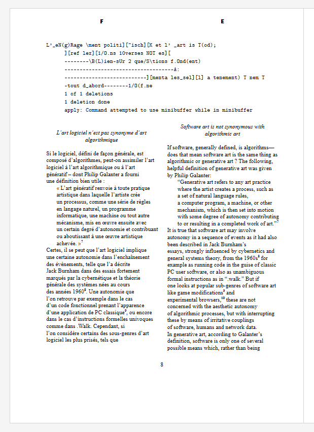

# Parallel Flows Tests - PagedJS Plugin

Test suite and examples for the parallel-flows plugin for [PagedJS](https://github.com/pagedjs/pagedjs/), demonstrating multi-language parallel text layouts in paged media.

## Table of Contents

- [Parallel Flows Tests - PagedJS Plugin](#parallel-flows-tests---pagedjs-plugin)
  - [Table of Contents](#table-of-contents)
  - [About](#about)
  - [Browser Compatibility](#browser-compatibility)
  - [Getting Started](#getting-started)
    - [Prerequisites](#prerequisites)
    - [Installation](#installation)
  - [Configuration](#configuration)
    - [Flow Location Options](#flow-location-options)
    - [Key CSS Custom Properties](#key-css-custom-properties)
  - [Example: French-English Bilingual Layout](#example-french-english-bilingual-layout)
    - [What This Demonstrates](#what-this-demonstrates)
    - [Folder layout](#folder-layout)
    - [Files setup](#files-setup)
    - [parallel-impact](#parallel-impact)
  - [Resources](#resources)
  - [Repository](#repository)
  - [Deployment Status](#deployment-status)

## About

This repository contains publication tests and working examples for the parallel-flows plugin, which enables side-by-side rendering of multiple content flows (such as bilingual texts) in print-ready layouts.

*Note: Everything here is taken from the official documentation of the plugin available at this address: [https://css-print-lab.github.io/specs/parallel-flows-in-css-print/](https://css-print-lab.github.io/specs/parallel-flows-in-css-print/)*

## Browser Compatibility

This project has been tested on the latest version of Google Chrome.

## Getting Started

### Prerequisites

- Modern web browser
- Local web server (for testing)

### Installation

1. Clone this repository
2. Ensure all dependencies are in place (see folder structure below)
3. Open `index.html` in a browser via a local server

## Configuration

### Flow Location Options

The plugin supports different flow positioning strategies:

- `samepage`: Places parallel flows on the same page (default in this example)
- [Add other options if applicable]

### Key CSS Custom Properties

- `--parallel-flow`: Defines which flow group an element belongs to
- `--parallel-impact`: Controls how elements affect all parallel flows (values: `all`, etc.)

## Example: French-English Bilingual Layout

This example demonstrates a two-column bilingual layout with French and English text without flow synchronization.

### What This Demonstrates

- Two-column parallel text layout
- Independent flow management per language
- Shared visual elements using `parallel-impact`
- Custom font loading and baseline alignment

*note : everything here is taken from the official documentation of the plugin avalaible at this address: [https://css-print-lab.github.io/specs/parallel-flows-in-css-print/](https://css-print-lab.github.io/specs/parallel-flows-in-css-print/)*

Plugin usage in example with 2 languages, here French and Engligh with 2 columns by page without flow-synchronisation feature activated.

### Folder layout

```plaintext
├── F-E_2cols_noSync
│   ├── css
│   │   ├── fonts
│   │   │   ├── Affigere-Regular.otf
│   │   │   ├── AntiqueSerie-Regular.otf
│   │   │   ├── AntiqueSerie-Regular.woff
│   │   │   └── cmuntb.ttf
│   │   ├── modules
│   │   │   ├── _baseline.css
│   │   │   ├── _interface.css
│   │   │   └── _variables.css
│   │   ├── interface.css
│   │   └── print.css
│   ├── images
│   ├── js
│   │   ├── csstree.js
│   │   ├── note-management.js
│   │   ├── paged.polyfill.js
│   │   ├── parallel-flows.js
│   │   ├── reload-in-place.js
│   │   ├── test-setup.js
│   │   └── text-cleaner.js
│   └── index.html
```

### Files setup

```html
<!-- index.html -->
<head>
<link href="./css/interface.css" rel="stylesheet" type="text/css" />
<link href="./css/print.css" rel="stylesheet" type="text/css" />

<!-- pagedjs as polyfill -->
<script src="./js/paged.polyfill.js"></script>

<!-- csstree for reading custom css rules -->
<script src="./js/csstree.js"></script>

<!-- main plugin file -->
<script src="./js/parallel-flows.js"></script>

<!-- additionnal scripts and plugin for confort and text management special purposes -->
<script src="./js/reload-in-place.js"></script>
<script src="./js/note-management.js"></script>
<script src="./js/text-cleaner.js"></script>
</head>

<body>
<section class="chapter a" id="content_fr" lang="fr">
... <!-- french html content -->
</section>

<section class="chapter c" id="content_en" lang="en">
... <!-- english html content -->
</section>
</body>
```

```css
/* print.css */
@page {
  margin-top: 15mm;
  margin-bottom: 39mm;
  size: 170mm 240mm;
}

section {
  width: 64mm !important;
  height: 185mm !important;
}

/* French content: positioned in left column */
section.a {
  --parallel-flow: beta;  /* Assigns to 'beta' flow group */
  margin-left: 0;         /* Align to left edge */
}

/* English content: positioned in right column */
section.c {
  --parallel-flow: beta;  /* Same flow group for parallel rendering */
  margin-left: auto;      /* Align to right edge */
}
```

```js
// parallel-flows.js
// to put the content on the same page
this.flowLocation = "samepage";
```

### parallel-impact

For shared items that are identical in the 2 flows, we chose to keep a single occurence of the item in one of the 2 flows, here it is only in the french section, so inside "section a" with the following css.
Note that the width value here is only for our chosen format.

```html
<div id="fig_1_fr">
...
</div>
<style>
#fig_1_fr {
  --parallel-impact: all;
  width: 134mm;
</style>
}
```

  
**Result:** The figure appears in the layout and both text flows adjust around it.

## Resources

- [Official Plugin Documentation](https://css-print-lab.github.io/specs/parallel-flows-in-css-print/)
- [PagedJS Documentation](https://pagedjs.org/documentation/)
- [Live Demo](https://parallel-flows-pub.netlify.app/)

## Repository

- **GitLab**: [https://gitlab.com/esad-gv1/epe/pagedjs_parallel-flows_tests](https://gitlab.com/esad-gv1/epe/pagedjs_parallel-flows_tests)
- **GitHub**: [https://github.com/rbottura/pagedjs_collab](https://github.com/rbottura/pagedjs_parallel-flows_tests)

## Deployment Status

[](https://app.netlify.com/projects/parallel-flows-pub/deploys)
